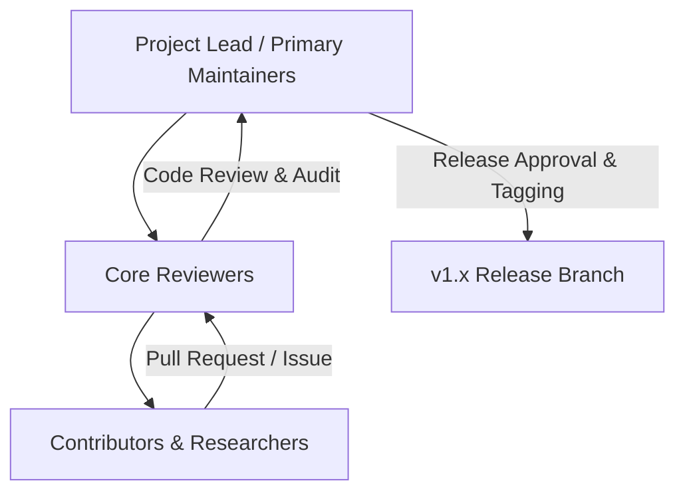
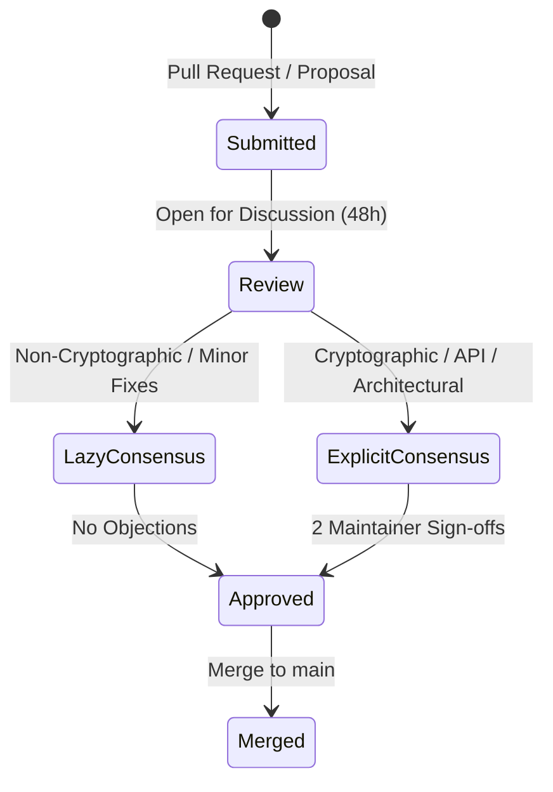

# KDR-CA-AEAD Repository Governance Policy

**Framework:** Keyed Dynamically-Reconfigured Cellular Automata with Authenticated Encryption (KDR-CA-AEAD v1.0.0)  
**Document Version:** 1.0.0  
**Effective Date:** August 5, 2026  

---

## 1. Project Mission & Vision

The primary mission of the **KDR-CA-AEAD** project is to advance open, provably secure, lightweight authenticated encryption primitives based on high-entropy Cellular Automata (CA) and HKDF-SHA256 key derivation. 

KDR-CA-AEAD is dedicated to delivering high-performance, constant-time cryptographic primitives suitable for resource-constrained environments, edge computing, and high-throughput security applications. The project prioritizes:
- **Mathematical Integrity**: Rigorous formal proof of security (IND-CCA2, INT-CTXT) and empirical strict avalanche validation (SAC ~ 50.12%).
- **Side-Channel Defense**: Strict constant-time MAC tag verification (`hmac.compare_digest`) and Encrypt-then-MAC (EtM) structural integrity.
- **Open Scientific Reproducibility**: Transparent benchmark datasets, open publication artifacts, and accessible verification tools.

---

## 2. Repository Governance Model

KDR-CA-AEAD operates under a **Benevolent Dictator / Core Maintainer Governance Model**, tailored for open-source academic and cryptographic research projects.

### Roles & Access Hierarchy

| Role | Key Responsibilities | Access Level |
| :--- | :--- | :--- |
| **Project Lead** | Overall project vision, final architecture decisions, security embargo oversight, cryptographic policy. | Admin / Owner |
| **Maintainers** | PR review & merging, release management, CI/CD pipeline maintenance, issue triage. | Write / Maintain |
| **Core Reviewers** | Security auditing, benchmark review, code quality verification, documentation audit. | Write / Triage |
| **Contributors** | Submitting bug reports, documentation updates, non-breaking feature enhancements, test additions. | Read / Fork |

---

## 3. Roles and Responsibilities

### 3.1 Maintainer Responsibilities
- Ensure overall repository health, CI build status, and security posture.
- Oversee the release lifecycle (SemVer v1.0.0+) and sign off on release tags.
- Manage private security disclosures with a strict 48-hour response SLA.
- Protect master branch integrity via enforced branch protection rules and mandatory reviews.

### 3.2 Core Reviewer Responsibilities
- Review pull requests for strict adherence to coding standards, constant-time operations, and PEP 8 guidelines.
- Audit proposed modifications to ensure no regressions in cryptographic security bounds or Strict Avalanche Criteria (SAC).
- Verify that unit and integration test coverage remains above 90%.

### 3.3 Contributor Responsibilities
- Abide by the project [Code of Conduct](CODE_OF_CONDUCT.md).
- Ensure all contributions are original or properly licensed under Apache-2.0.
- Write unit tests for any proposed bug fixes or enhancements.
- Keep pull requests focused, concise, and linked to relevant GitHub Issues.

---

## 4. Decision-Making & Consensus Guidelines

The project employs **Lazy Consensus** for routine operations and **Explicit Consensus** for critical modifications.

- **Lazy Consensus (Minor Edits & Documentation)**:
  - Edits to documentation, non-functional code styling, or issue templates require 1 maintainer approval. If no objections are raised within 48 hours, the PR may be merged.
- **Explicit Consensus (Core Modifications)**:
  - Changes affecting public APIs, key derivation routines (`shaModule.py`), state transition matrices (`crypto/`), or evaluation metrics (`metrics/`) **MUST** receive explicit written sign-off from at least 2 primary maintainers.

---

## 5. Release Approval Workflow

Releases are executed strictly according to [Semantic Versioning 2.0.0](https://semver.org/).

1. **Pre-Release Audit**:
   - Automated CI build and full test execution (`pytest`).
   - Constant-time verification audit and static security analysis (`bandit`).
2. **Documentation Review**:
   - Sync [`CHANGELOG.md`](CHANGELOG.md) and update API navigation references.
3. **Formal Maintainer Sign-Off**:
   - Minimum of 2 maintainer approvals required for any minor (`1.X.0`) or major (`X.0.0`) release tag.
4. **Git Tagging & Release Asset Generation**:
   - GPG-signed git tag pushed to `main`.
   - Release archive published with checksums (SHA-256).

---

## 6. Issue Escalation Process

If a conflict or technical dispute arises regarding code implementation, architectural direction, or PR rejection:

1. **Discussion Level**: Technical discussions take place publicly within the relevant GitHub Issue or Pull Request thread.
2. **Reviewer Escalation**: If consensus cannot be reached within 7 days, the issue is referred to a Core Reviewer for formal evaluation.
3. **Project Lead Arbitration**: If the dispute remains unresolved, the Project Lead reviews the technical evidence, security implications, and project roadmap to make a final binding decision.

---

## 7. Code Ownership Policy

The project uses GitHub `CODEOWNERS` guidelines to enforce review coverage across major sub-modules:

| Directory Path | Designated Owners | Focus Area |
| :--- | :--- | :--- |
| `/crypto/` | `@ashshetty26`, `@chintanshetty` | Core CA State Engine & HKDF Key Derivation |
| `/benchmarks/` | `@ashshetty26` | Performance & Throughput Profiling |
| `/evaluation_results/` | `@chintanshetty` | SAC, NIST SP 800-22, Avalanche Data |
| `/paper/` | `@ashshetty26`, `@chintanshetty` | IEEE Publication LaTeX Source Files |
| `/docs/` | Core Maintainers | Architecture & API Reference Documentation |
| `/.github/` | Maintainers | CI/CD Workflows & Repository Health |

---

## 8. Governance Amendments

Amendments to this Governance Policy may be proposed via Pull Request to `GOVERNANCE.md`. Amendments require unanimous sign-off from all active Project Leads and a 14-day public comment period.
