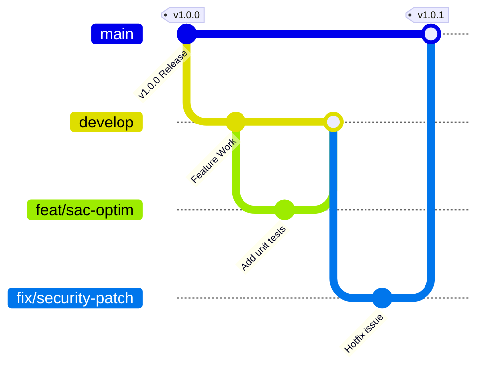
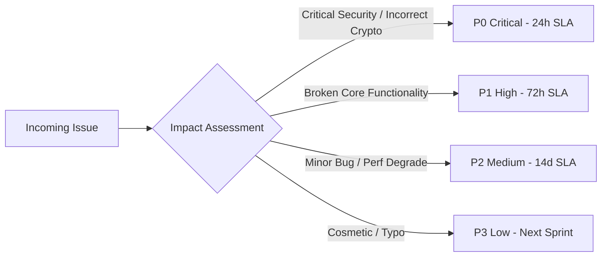
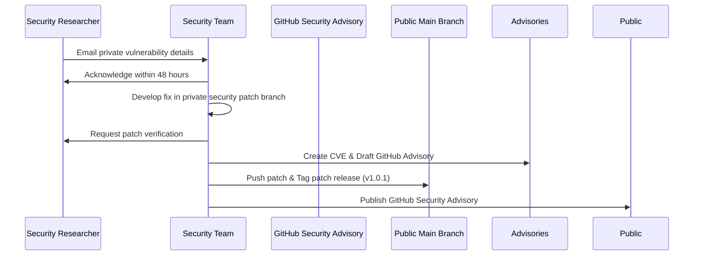

# KDR-CA-AEAD Repository Maintenance Guide

**Framework:** Keyed Dynamically-Reconfigured Cellular Automata with Authenticated Encryption (KDR-CA-AEAD v1.0.0)  
**Document Version:** 1.0.0  
**Effective Date:** August 5, 2026  

---

## 1. Repository Maintenance Philosophy

The maintenance philosophy of **KDR-CA-AEAD** is built upon three core pillars:
1. **Security & Cryptographic Stability First**: The cryptographic core must remain deterministic, provably secure, and constant-time across all minor releases.
2. **Long-Term Backward Compatibility**: Public APIs (`encrypt.py`, `decrypt.py`, `crypto/`) must preserve exact signature contracts for v1.x releases.
3. **Transparent Supply Chain & Zero Technical Debt**: Dependencies are minimized, strictly audited, and locked via checksum-verified dependency graphs.

---

## 2. Branch Strategy

KDR-CA-AEAD follows a standardized Git flow branch management model:

### Branch Naming Conventions
- `main`: Production-ready, stable code corresponding to formal release tags (e.g., `v1.0.0`).
- `develop`: Integration branch for upcoming minor release candidates.
- `feat/<short-description>`: Feature branches for new functionality or documentation expansions.
- `fix/<short-description>`: Bug fixes and maintenance patches.
- `security/<cve-or-issue>`: Confidential branch for addressing reported vulnerabilities prior to release.

---

## 3. Version Support Policy

KDR-CA-AEAD adheres to **Semantic Versioning 2.0.0** (`MAJOR.MINOR.PATCH`).

| Version Series | Support Status | Active Maintenance | Security Patches | End of Life (EOL) |
| :--- | :--- | :--- | :--- | :--- |
| **v1.x (LTS)** | **Active LTS** | Yes | Guaranteed | August 2029 (3-Year Minimum) |
| **v0.x (Legacy)** | Deprecated | No | Critical Only | August 2026 |

- **MAJOR (`X.0.0`)**: Incompatible API changes or fundamental cryptographic specification updates.
- **MINOR (`1.X.0`)**: Backward-compatible feature additions, performance optimizations, or new benchmark tools.
- **PATCH (`1.0.X`)**: Backward-compatible bug fixes, documentation clarifications, or security patches.

---

## 4. Bug Triage Workflow

All incoming issues are triaged within 24–48 hours according to the following priority matrix:

### Priority Definitions
- **P0 Critical**: Vulnerabilities affecting confidentiality, integrity, tag verification, or side-channel resistance. (Response SLA: < 24 hrs).
- **P1 High**: Broken build, test suite failure on supported platforms, or memory leaks. (Response SLA: < 72 hrs).
- **P2 Medium**: Performance degradation, non-critical CLI/tooling bugs. (Response SLA: < 14 days).
- **P3 Low**: Formatting improvements, typos, or clarification in docs. (Triaged during standard release cycles).

---

## 5. Dependency Update Policy

To prevent supply-chain attacks and unexpected behavior:
1. **Minimal External Dependencies**: Core encryption and key derivation (`encrypt.py`, `decrypt.py`, `crypto/`) rely strictly on the Python Standard Library (`hashlib`, `hmac`, `os`, `secrets`).
2. **Dependabot Automated Scanning**: Automated PRs are created weekly for non-core dependencies (e.g., `pytest`, `flask`, `matplotlib`).
3. **Pinning & SHA-256 Hashes**: Dependencies in `requirements.txt` are explicitly pinned to exact versions.

---

## 6. Security Patch Process

---

## 7. Documentation Maintenance

Documentation integrity is maintained through the following procedures:
- **Navigation Verification**: All new `.md` files must be indexed in [`docs/navigation.md`](docs/navigation.md).
- **Markdown Hygiene**: Headers must follow standard GFM structure with clean relative links.
- **LaTeX Synchronization**: Equations in `docs/` must align with the formal IEEE publication paper (`paper/`).

---

## 8. Release Maintenance Checklist

Before tagging any release (e.g., `v1.0.1` or `v1.1.0`), maintainers must complete the following steps:

- [ ] Execute complete test suite: `$env:PYTHONPATH="."; python -m pytest tests/`
- [ ] Run security code scanner: `bandit -r crypto/ app.py`
- [ ] Verify constant-time comparison in MAC verification (`hmac.compare_digest`).
- [ ] Verify Strict Avalanche Criteria (SAC) stability against test vectors.
- [ ] Update version string in `setup.py`, `CITATION.cff`, and `docs/conf.py` (if present).
- [ ] Update [`CHANGELOG.md`](CHANGELOG.md) under the release heading.
- [ ] Create and sign GPG Git tag: `git tag -s -m "Release vX.Y.Z" vX.Y.Z`
- [ ] Publish release notes and SHA-256 release checksums on GitHub.

---

## 9. Long-Term Maintenance Recommendations

1. **Automated Continuous Integration**: Maintain GitHub Action runners across Python 3.9, 3.10, 3.11, and 3.12 on Linux, Windows, and macOS.
2. **Periodic Cryptographic Audits**: Conduct annual reviews of key derivation parameters and random number generation sources (`os.urandom`).
3. **Academic Continuity**: Ensure CITATION.cff and IEEE bibtex entries remain up-to-date as paper publications progress.
