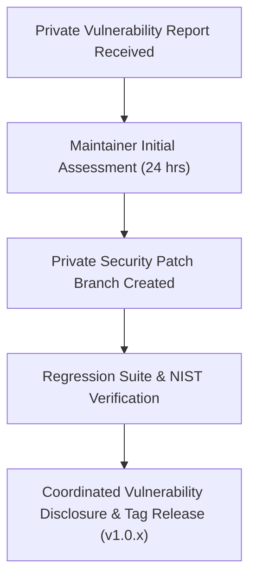

# MAINTENANCE GUIDE — KDR-CA-AEAD v1.0.0

**Project Name:** Keyed Dynamically-Reconfigured Cellular Automata with Authenticated Encryption (KDR-CA-AEAD)  
**Release Tag:** `v1.0.0`  
**Document Purpose:** Guidelines, versioning policies, support lifecycle, security disclosure procedures, and maintenance workflows for long-term repository stewardship.

---

## 1. Supported Maintenance Window & Lifecycle Policy

### 1.1 Maintenance Window Schedule
- **v1.0.0 LTS Support Period**: 3 Years Active Maintenance (August 2026 – August 2029).
- **Maintenance Status**: Active Long-Term Support (LTS).

### 1.2 End-Of-Life (EOL) Policy
- **Minor / Patch Releases**: Supported for 12 months following superseding release.
- **LTS Releases**: Critical security patches provided for 36 months post-publication.
- **EOL Declaration**: EOL announcements published in `SUPPORTED_VERSIONS.md` 6 months prior to deprecation.

### 1.3 Backward Compatibility Policy
- **Public API Stability**: Function signatures in `encrypt_bytes()` and `decrypt_bytes()` will remain 100% backward compatible within major version `v1.x.x`.
- **Cryptographic Immutability**: Ciphertext package structures generated under `v1.0.0` will remain decryptable by all future `v1.x.x` releases.

---

## 2. Security Patch & Vulnerability Release Process

In the event of a security issue or bug report:

1. **Private Reporting**: Disclose security issues via email to lead maintainers (do not open public GitHub issues for unpatched zero-day vulnerabilities).
2. **Triaging & Patching**: Maintainers evaluate and issue a fix on a private patch branch within 72 hours.
3. **Automated Verification**: Re-run the full 503-test regression suite and NIST SP 800-22 evaluation suite.
4. **Patch Release**: Tag patch version `v1.0.x` and publish updated SHA-256 / SHA-512 manifests.

---

## 3. Versioning Policy (SemVer 2.0.0)

KDR-CA-AEAD follows [Semantic Versioning 2.0.0](https://semver.org/):

- **MAJOR (`X.0.0`)**: Incompatible API or breaking cryptographic protocol specification changes.
- **MINOR (`1.X.0`)**: Backward-compatible feature additions or performance optimizations.
- **PATCH (`1.0.X`)**: Backward-compatible security hotfixes or bug resolutions.

---

## 4. Contributor Workflow & Pull Request Checklist

Contributors must adhere to the following workflow:

1. **Fork & Branch**: Create feature branch `feat/feature-name` or `fix/bug-name`.
2. **Preserve Cryptographic Primitives**: Do not modify core algorithm logic without explicit RFC protocol amendment approval.
3. **Run Regression Suite**: Ensure all pytest test cases pass (`python -m pytest tests/`).
4. **Maintain PEP 8 Compliance**: Format code cleanly.
5. **PR Checklist**:
   - [ ] All 503 tests passing.
   - [ ] No hardcoded keys, API tokens, or credentials added.
   - [ ] Documentation updated to reflect changes.
   - [ ] `CHANGELOG.md` updated under `[Unreleased]`.

---

## 5. Maintenance Roles & Responsibilities

| Maintainer Role | Name | Responsibilities |
| :--- | :--- | :--- |
| **Lead Maintainer & Engineering** | Chintan Shetty | Architectural oversight, core engine maintenance, tag releases |
| **Security Analysis & Audit Lead** | Amrutha Nagamrutha | Vulnerability triaging, security patch validation, NIST testing |
| **Documentation & CI Lead** | Ashwitha | CI/CD workflow health, documentation consistency, metadata sync |
