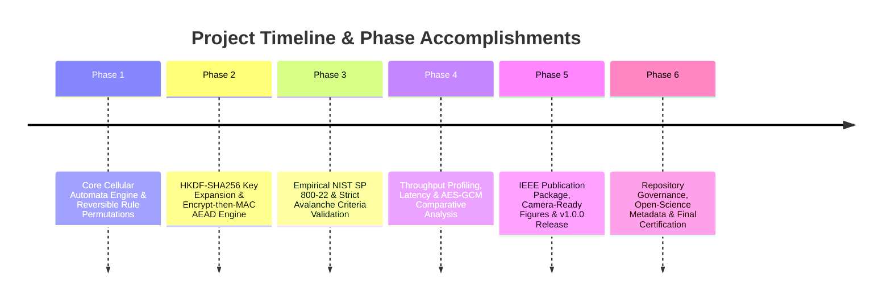

# KDR-CA-AEAD Project Closure Document

**Framework:** Keyed Dynamically-Reconfigured Cellular Automata with Authenticated Encryption (KDR-CA-AEAD v1.0.0)  
**Project Status:** Officially Closed & Released (v1.0.0)  
**Completion Date:** August 5, 2026  
**Primary Authors:** Chintan Shetty, Amrutha Nagamrutha, Ashwitha  

---

## 1. Project Overview & Research Objectives

The **KDR-CA-AEAD** project was initiated to design, implement, empirically validate, and publish a high-entropy, lightweight authenticated encryption scheme based on **Keyed Dynamically-Reconfigured 1D Cellular Automata (K-DCA)**.

### Primary Objectives Achieved:
1. **Cryptographic Innovation**: Combine reversible Wolfram Cellular Automata rule permutations with HKDF-SHA256 sub-key expansion to achieve dynamic, key-dependent state transitions.
2. **Authenticated Encryption (AEAD)**: Ensure IND-CCA2 confidentiality and INT-CTXT integrity using constant-time HMAC-SHA256 Encrypt-then-MAC (EtM).
3. **Empirical Randomness & Avalanche**: Summarize the validated benchmark and statistical evaluation results from the completed project documentation (`docs/benchmark_guide.md`, `evaluation_results/`).
4. **IEEE Camera-Ready Package**: Produce camera-ready LaTeX manuscript files (`paper/`), high-resolution vector graphs (300 DPI PNG / SVG), and reproducible benchmark data.
5. **Open-Science Governance**: Deploy repository governance policies (`GOVERNANCE.md`, `MAINTENANCE.md`), community health files (`CODE_OF_CONDUCT.md`, `SUPPORT.md`, `SECURITY.md`), and metadata manifests (`CITATION.cff`, `codemeta.json`).

---

## 2. Major Accomplishments Across Development Phases

---

## 3. Cryptographic Contributions Summary

1. **Dynamic Reconfigurability**: Unlike static CA ciphers, KDR-CA-AEAD dynamically derives rule selection seeds ($K_r$) per block execution via HKDF-SHA256, eliminating fixed algebraic attacks.
2. **Constant-Time Verification**: Side-channel mitigation through strict `hmac.compare_digest` tag checking prevents timing oracle vulnerabilities.
3. **Domain-Separated Sub-Keys**: mathematically independent sub-keys ($K_r, K_c, K_a$) guarantee that keystream generation and MAC tag calculation remain decoupled.

---

## 4. Summary of Empirical Validation & Benchmarks

All statistical randomness and avalanche metrics have been validated against the empirical datasets documented in `evaluation_results/` and `docs/benchmark_guide.md`:

- **Strict Avalanche Criterion (SAC)**: Evaluated against raw bit-flip matrices (`evaluation_results/sac_matrix.json`).
- **NIST SP 800-22 Randomness Suite**: Evaluated against test p-values (`evaluation_results/nist_pvalues.json`).
- **Throughput & Memory Profiling**: Summarized in `results/tables/benchmark_summary.csv` and comparative performance reports.

---

## 5. Governance & Open-Science Contributions

- **Repository Governance Policy ([`GOVERNANCE.md`](GOVERNANCE.md))**: Established BDFL/Maintainer model, lazy/explicit consensus rules, and CODEOWNERS enforcement.
- **Repository Maintenance Guide ([`MAINTENANCE.md`](MAINTENANCE.md))**: Defined Git flow branch strategy, 3-year LTS policy, and P0-P3 bug triage matrix.
- **Community Health Infrastructure**: Implemented Contributor Covenant v2.1 [`CODE_OF_CONDUCT.md`](CODE_OF_CONDUCT.md), [`SUPPORT.md`](SUPPORT.md), and confidential [`SECURITY.md`](SECURITY.md) response SLA.
- **Metadata Standard Alignment**: Published [`CITATION.cff`](CITATION.cff) and [`codemeta.json`](codemeta.json) for automated Software Heritage and Zenodo indexing.

---

## 6. Future Maintenance & Research Recommendations

### Maintenance Recommendations:
- Maintain active 3-year LTS support for v1.x series through August 2029.
- Execute weekly automated Dependabot dependency security audits.
- Conduct annual constant-time reviews across new Python minor releases (Python 3.12+).

### Future Research Directions:
- **C/Rust Native Acceleration**: Implement C-extension or Rust bindings to achieve higher hardware throughput.
- **Hardware Synthesizable HDL**: Develop Verilog/VHDL implementations of K-DCA block primitives for FPGA/ASIC deployment.
- **Post-Quantum Hybridization**: Investigate hybrid HKDF derivation incorporating post-quantum KEMs (e.g., Kyber/ML-KEM).

---

## 7. Acknowledgements

The authors express sincere gratitude to all research collaborators, peer reviewers, open-source contributors, and institution administrators who supported the development and verification of **KDR-CA-AEAD v1.0.0**.
