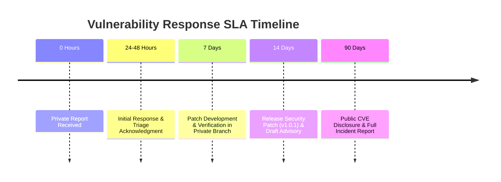

# Security Policy

**Framework:** Keyed Dynamically-Reconfigured Cellular Automata with Authenticated Encryption (KDR-CA-AEAD v1.0.0)  
**Effective Date:** August 5, 2026  

The maintainers of **KDR-CA-AEAD** take the security of our cryptographic implementations, key derivation engines, and side-channel defenses very seriously. This document outlines our supported versions, vulnerability reporting process, and disclosure policies.

---

## 1. Supported Versions

Security fixes are actively maintained for the following versions:

| Version Series | Supported | Security Update Commitment |
| :--- | :--- | :--- |
| **v1.0.x (Current Release)** | **Yes** | Active security support for all critical/high vulnerabilities. |
| **v0.x (Pre-release/Draft)** | No | EOL – Users must upgrade to v1.0.0+. |

---

## 2. Reporting a Vulnerability

> [!CAUTION]
> **DO NOT create a public GitHub issue, pull request, or discussion topic for security vulnerabilities.**

If you discover a security flaw, potential side-channel leak, tag verification timing discrepancy, or algorithm flaw in KDR-CA-AEAD:

1. **Email Contact**: Send a private report directly to:
   - Primary: `shettyashwitha26@gmail.com`
   - Secondary: `chntnshetty@gmail.com`

2. **Report Information Needed**:
   - Description of the vulnerability (e.g., timing side-channel, tag forgery, non-constant-time operation).
   - Minimal proof-of-concept (PoC) script demonstrating the issue.
   - Impact assessment (e.g., key recovery, plaintext exposure, MAC forgery).
   - Any suggested mitigations or patches.

---

## 3. Vulnerability Response Timeline

Upon receiving a private vulnerability report, the maintainers will adhere to the following SLA:

- **Acknowledgment**: Within **48 hours**, we will acknowledge receipt of your report and begin initial triage.
- **Assessment**: Within **7 days**, we will confirm or dispute the vulnerability and provide an estimated fix timeline.
- **Patch & Release**: Within **14 days**, a verified patch will be cut and tagged as a patch release (e.g., `v1.0.1`).
- **Public Disclosure**: A 90-day embargo applies from initial notification, after which a public GitHub Security Advisory and CVE description will be published.

---

## 4. Security Architecture & Guarantees

For complete details on our threat model, constant-time guarantees (`hmac.compare_digest`), HKDF key separation, and avalanche properties, please consult our formal [`docs/security_guide.md`](docs/security_guide.md).
