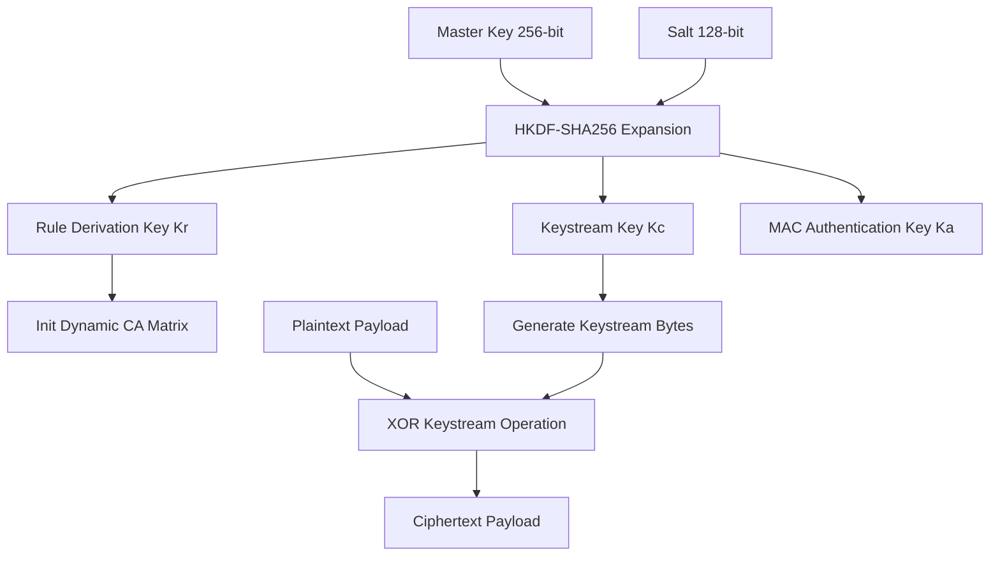
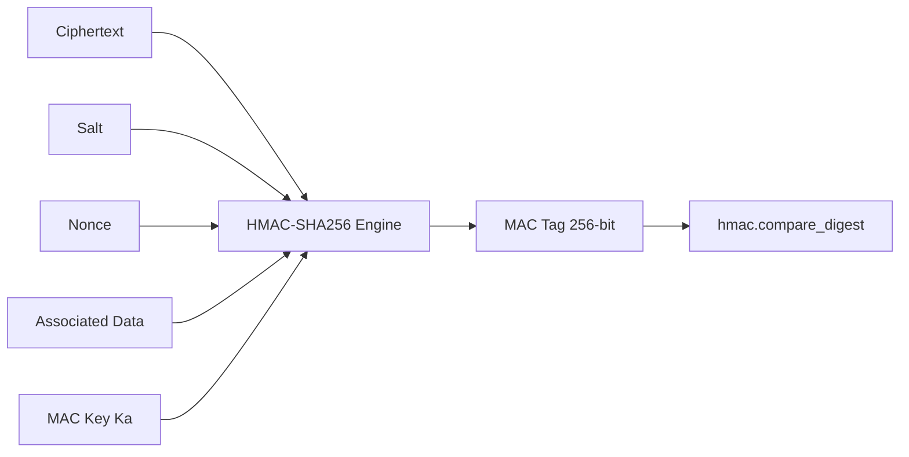

# Comprehensive Architecture Specification Guide

**Framework:** Keyed Dynamically-Reconfigured Cellular Automata with Authenticated Encryption (KDR-CA-AEAD v1.0.0)  
**Document Version:** 1.0.0  

---

## 1. Package Hierarchy & Module Architecture

```text
crypto/
├── __init__.py           # Package exports (encrypt_bytes, decrypt_bytes, EncryptedPackage)
├── engine.py             # Top-level AEAD orchestrator
├── ca_engine.py          # 1D Cellular Automata state engine
├── key_derivation.py     # HKDF-SHA256 key schedule engine
└── models.py             # Dataclass data structures
```

---

## 2. Key Expansion & Encryption Pipeline



---

## 3. AEAD Authentication Pipeline (Encrypt-then-MAC)



---

## 4. Testing & Documentation Architecture

- **Unit Testing**: Located under `tests/unit/` testing individual CA state transitions, HKDF output independence, and data models.
- **Integration Testing**: Located under `tests/integration/` testing end-to-end AEAD encryption, decryption, and active ciphertext tampering detection.
- **Documentation Map**: Root index `docs/index.md` linking to all 25+ detailed guides.
