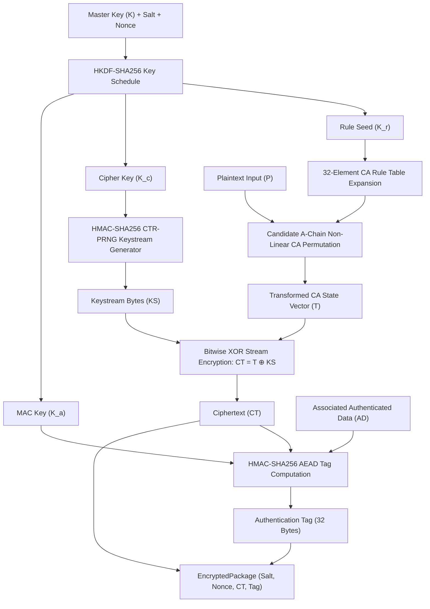
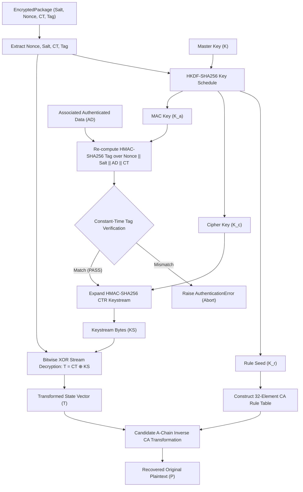
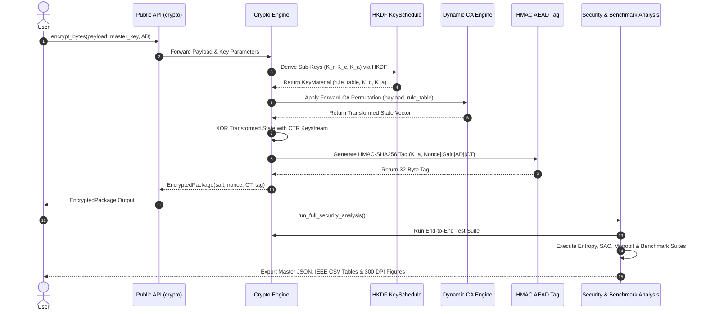

# KDR-CA-AEAD System Architecture & Workflow Specifications

**Framework:** Keyed Dynamically-Reconfigured Cellular Automata with Authenticated Encryption (KDR-CA-AEAD)  
**IEEE Mapping:** Section IV – System Architecture & Module Integration  
**Version:** 1.0.0 (Publication Candidate)  

---

## 1. Executive Architecture Overview

The **KDR-CA-AEAD** cryptographic framework is built on a modular, domain-separated architecture combining HKDF key derivation, Candidate A-Chain Dynamic Cellular Automata permutations, HMAC-SHA256 CTR-PRNG keystream generation, and Encrypt-then-MAC AEAD authentication.

```
                  +-----------------------------------+
                  |        User / Application API     |
                  +-----------------------------------+
                                    |
                                    v
                  +-----------------------------------+
                  |     High-Level Crypto Engine      |
                  |     (encrypt_bytes / decrypt)     |
                  +-----------------------------------+
                       /            |            \
                      v             v             v
          +---------------+  +-------------+  +---------------+
          | Key Schedule  |  | Dynamic CA  |  | AEAD MAC Tag  |
          | (HKDF-SHA256) |  | Permutation |  | (HMAC-SHA256) |
          +---------------+  +-------------+  +---------------+
                      \             |            /
                       v            v           v
                  +-----------------------------------+
                  |    EncryptedPackage Data Model    |
                  +-----------------------------------+
                                    |
                                    v
                  +-----------------------------------+
                  | Security Analysis & Benchmarking  |
                  +-----------------------------------+
```

---

## 2. Component Responsibilities

1. **User / Application API Layer (`crypto`)**: Exposes clean, typed interfaces for binary and string encryption/decryption (`encrypt_bytes`, `decrypt_bytes`).
2. **Key Derivation Subsystem (`crypto.engine.key_schedule`)**: Derives domain-separated sub-keys $K_r$ (rule seed), $K_c$ (cipher key), and $K_a$ (MAC key) using HKDF-SHA256 with CSPRNG salt and nonce context.
3. **Keyed Dynamic CA Engine (`crypto.engine.dynamic_ca`)**: Applies reversible Candidate A-Chain non-linear state transformations using Wolfram uint8 rule tables derived from $K_r$.
4. **Keystream PRNG Subsystem (`crypto.engine.encrypt`)**: Generates arbitrary-length keystream using HMAC-SHA256 Counter Mode (CTR-PRNG) parameterized by $K_c$ and Nonce.
5. **Authenticated Encryption Subsystem (`crypto.engine.encrypt` / `decrypt`)**: Combines CA non-linear permutation, CTR stream encryption, and constant-time HMAC-SHA256 AEAD tag calculation over `Nonce || Salt || AssociatedData || Ciphertext`.
6. **Security & Benchmark Framework (`crypto.analysis`)**: Provides statistical randomness evaluation (NIST SP 800-22), avalanche effect measurement, performance benchmarks, and automated IEEE visualization generation.

---

## 3. Workflow Diagrams

### 3.1 Encryption Workflow Diagram



---

### 3.2 Decryption Workflow Diagram



---

### 3.3 Complete System Interaction Diagram


