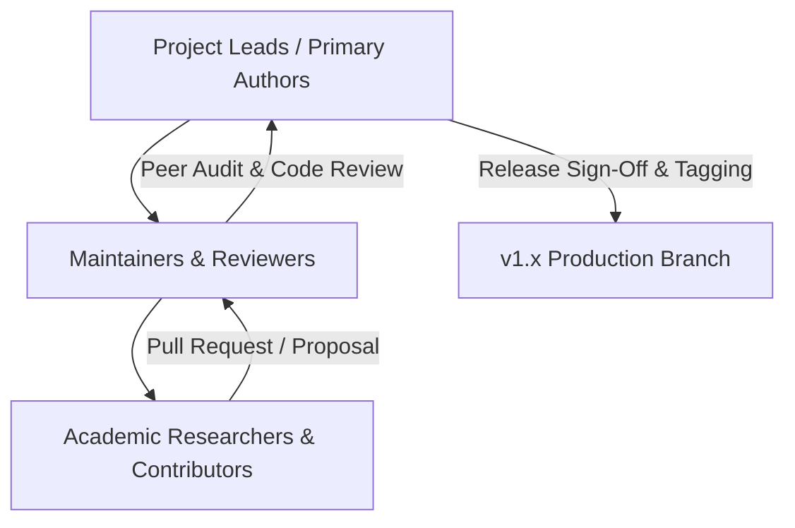
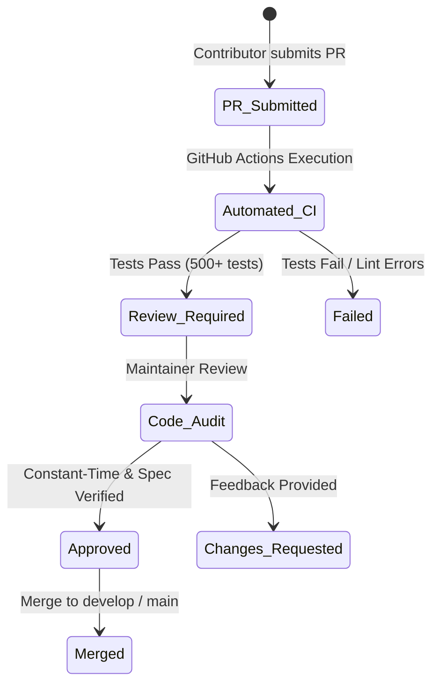

# KDR-CA-AEAD Academic & Technical Governance Framework

**Framework:** Keyed Dynamically-Reconfigured Cellular Automata with Authenticated Encryption (KDR-CA-AEAD v1.0.0)  
**Document Version:** 1.0.0  
**Effective Date:** August 5, 2026  

---

## 1. Project Ownership & Organization Structure

**KDR-CA-AEAD** operates under an **Academic Maintainer Committee Governance Model**, designed to maintain strict cryptographic rigor, scientific integrity, and open-source accessibility.

### Leadership & Ownership
- **Project Lead & Cryptography Architect**: Chintan Shetty (`chntnshetty`)
- **Co-Researcher & Validation Lead**: Amrutha Nagamrutha (`nagamrutha`)
- **Co-Researcher & Publication Lead**: Ashwitha (`ashshetty26`)

---

## 2. Roles and Responsibilities

### 2.1 Project Leads
- Maintain authority over architectural evolution, cryptographic specification changes, and release tags.
- Direct security embargo communications and vulnerability disclosures.

### 2.2 Maintainers & Core Reviewers
- Review incoming Pull Requests for adherence to PEP 8, typing, unit test coverage, and constant-time operations.
- Triage public issues, label requests, and manage CI/CD workflow health.

### 2.3 Contributors & Community Researchers
- Submit bug reports, documentation updates, performance scripts, or test case additions via Pull Requests.
- Abide by the project `CODE_OF_CONDUCT.md`.

---

## 3. Decision-Making & Consensus Workflows

KDR-CA-AEAD balances open collaboration with strict cryptographic safeguards using a two-tier consensus model:

1. **Lazy Consensus (Minor Edits & Documentation)**:
   - Non-functional changes, typos, or documentation additions require 1 maintainer approval. If no objections are raised within 48 hours, the PR may be merged.
2. **Explicit Consensus (Core Architecture & APIs)**:
   - Proposed changes affecting key expansion, Cellular Automata state matrices, MAC verification, or public API signatures **MUST** receive explicit sign-off from at least 2 Project Leads.

---

## 4. Pull Request Review & Release Approval Process

- **PR Review Checklist**:
  - Automated CI tests pass with 100% success rate.
  - No constant-time regressions (`hmac.compare_digest`).
  - Unit tests added for any new functionality.
  - Documentation updated in `docs/` and indexed in `docs/navigation.md`.

---

## 5. Conflict Resolution & Governance Evolution

- **Technical Disputes**: Technical disagreements are evaluated based on empirical benchmarks, formal proof of security, and test tracebacks. If consensus is not reached, the Project Lead provides binding arbitration.
- **Governance Evolution Policy**: Amendments to this governance document require a 14-day comment period and sign-off from Project Leads.
