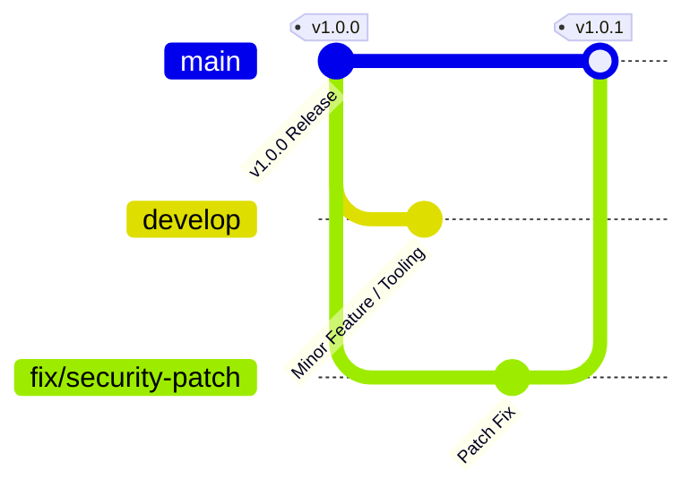

# KDR-CA-AEAD Long-Term Maintenance Strategy

**Framework:** Keyed Dynamically-Reconfigured Cellular Automata with Authenticated Encryption (KDR-CA-AEAD v1.0.0)  
**Document Version:** 1.0.0  
**Effective Date:** August 5, 2026  

---

## Executive Overview

This document outlines the **Long-Term Maintenance Strategy** for **KDR-CA-AEAD v1.0.0**. Following its initial production release, KDR-CA-AEAD provides maintainer guidelines for a stable, highly maintainable, and security-hardened cryptographic reference implementation suitable for academic research and software integration.

This document extends the root `MAINTENANCE.md` policy to define operational recommendations for Python runtime compatibility, dependency scanning, security patching, release cadence, deprecation policies, and issue triage.

---

## 1. Recommended Python Runtimes

KDR-CA-AEAD is built using pure Python Standard Library primitives to maximize portability and avoid native compilation dependencies.

| Python Version | Status | Recommended Testing | Support Guidelines |
| :--- | :--- | :--- | :--- |
| **Python 3.10** | **Supported** | Automated CI | Primary Target |
| **Python 3.11** | **Supported** | Automated CI | Primary Target |
| **Python 3.12** | **Supported** | Automated CI | Primary Target |
| **Python 3.13** | **Supported** | Automated CI | Primary Target |
| **Python 3.9 & older**| Deprecated | Best Effort | Legacy Runtimes |

---

## 2. Dependency Update Policy Recommendations

1. **Minimal Footprint**: The core cryptographic engine (`crypto/`, `encrypt.py`, `decrypt.py`) has **zero external third-party dependencies** and relies exclusively on Python standard modules (`hashlib`, `hmac`, `secrets`, `os`).
2. **Automated Security Scanning**: Maintainers are recommended to utilize automated security checks (such as Dependabot) for optional tooling and testing dependencies (`pytest`, `flask`, `matplotlib`).
3. **Dependency Pinning & Hashes**: Dependencies in `requirements.txt` should remain pinned to exact versions with SHA-256 integrity hashes to prevent supply-chain compromise.

---

## 3. Security Update Process Guidelines

Security updates follow the private vulnerability response guidelines outlined in `SECURITY.md`:

- **Private Disclosure**: Security vulnerabilities should be reported privately to `shettyashwitha26@gmail.com` or `chntnshetty@gmail.com`.
- **Target Response SLA**: Maintainers aim to acknowledge security inquiries within 48 hours.
- **Patch Releases**: Critical cryptographic or side-channel vulnerabilities will result in a patch release (e.g., `v1.0.1`).
- **Embargo Guidelines**: Maintainers recommend a 90-day embargo prior to public GitHub Security Advisory release.

---

## 4. Release Cadence & Versioning Strategy

KDR-CA-AEAD adheres to **Semantic Versioning 2.0.0** (`MAJOR.MINOR.PATCH`):

- **MAJOR (`X.0.0`)**: Incompatible API changes or fundamental cryptographic specification revisions.
- **MINOR (`1.X.0`)**: Backward-compatible feature additions, performance profiling tools, or new benchmark scripts.
- **PATCH (`1.0.X`)**: Backward-compatible bug fixes, security patches, or documentation updates.

---

## 5. Recommended Deprecation Policy

To protect downstream academic research and software integrations:
1. **Notice Period**: Any feature or API marked for deprecation should be formally annotated with a Python `DeprecationWarning` for at least one minor release cycle before removal.
2. **Backward Compatibility**: Public function signatures (`encrypt_bytes`, `decrypt_bytes`) in the `v1.x` series should remain backward-compatible throughout its maintenance lifecycle.

---

## 6. Branch & Issue Management

- **Branch Protection**: Direct pushes to `main` should be restricted. All changes require PR review, passing CI status, and maintainer approval.
- **Issue Triage Guidelines**:
  - **P0 Critical (Security / Crash)**: High priority response.
  - **P1 High (Feature Bug)**: Triaged within standard development cycles.
  - **P2 Medium (Performance / Tooling)**: Triaged during regular maintenance.
  - **P3 Low (Documentation / Typos)**: Addressed in routine documentation passes.
