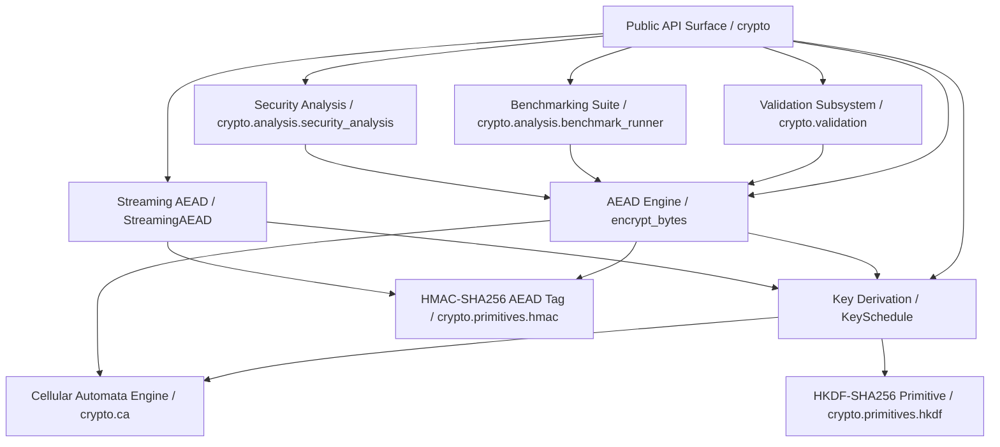
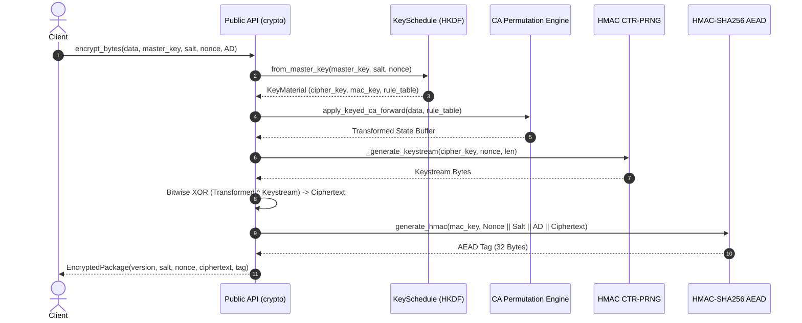

# Phase 4.1 – End-to-End System Integration Report & Specification

## I. Executive Summary

This document specifies the Phase 4.1 End-to-End System Integration architecture for the **KDR-CA-AEAD** (Keyed Dynamically-Reconfigured Cellular Automata Authenticated Encryption with Associated Data) research framework.

Phase 4.1 unifies all Phase 1, Phase 2, and Phase 3 cryptographic, benchmarking, validation, and security analysis subsystems into a single, cohesive, production-grade framework.

---

## II. Subsystem Architecture & Component Breakdown

### Core Subsystems

1. **Cellular Automata Engine (`crypto/ca`)**: Provides elementary CA permutation rules, dynamic rule sequence transformations, and non-linear byte diffusion state updates.
2. **Key Schedule & Derivation (`crypto/key`)**: Derives sub-keys (cipher key $K_c$, MAC key $K_m$, CA rule selection tables) from master key material via HKDF-SHA256.
3. **AEAD Core Engine (`crypto/engine`)**: High-level `encrypt_bytes`, `encrypt_payload`, `decrypt_bytes`, and `decrypt_payload` implementing Encrypt-then-MAC with dynamic CA permutations.
4. **Streaming AEAD (`crypto/primitives/streaming`)**: Chunked streaming encryption and decryption (`StreamingAEAD`) with canonical framing and chunk-reordering protection.
5. **Validation Engine (`crypto/validation`)**: Automated statistical security evaluator (`ValidationRunner`) providing Avalanche, SAC, BIC, Entropy, and NIST SP 800-22 test suites.
6. **Benchmark Framework (`crypto/analysis/benchmark_runner` & `benchmarks/`)**: Micro-benchmarking, throughput scaling, and memory allocation profilers.
7. **Security Analysis (`crypto/analysis`)**: Comprehensive security audit generators for publication and IEEE manuscript draft reporting.

---

## III. End-to-End Execution Sequence

---

## IV. Subsystem Compatibility Matrix

| Source Subsystem | Target Subsystem | Interaction Focus | Status |
| :--- | :--- | :--- | :--- |
| `crypto/ca` | `crypto/key` | Keyed CA rule selection table generation | Verified |
| `crypto/key` | `crypto/engine` | KeyMaterial distribution ($K_c, K_m, \text{rule\_table}$) | Verified |
| `crypto/engine` | `crypto/primitives` | CTR-PRNG stream cipher & HMAC-SHA256 tag calculation | Verified |
| `crypto/engine` | `crypto/primitives/streaming` | Streaming header framing & chunked AEAD authentication | Verified |
| `crypto/primitives` | `crypto/validation` | `ValidationRunner` security analysis execution | Verified |
| `crypto/validation` | `crypto/benchmark` | Exporting formatted reports (Markdown, LaTeX, JSON) | Verified |
| `crypto/analysis` | `reports/` | Publication readiness & end-to-end pipeline verification | Verified |

---

## V. Serialization & Format Specifications

### 1. `EncryptedPackage` Data Representation
- **`version`**: Protocol version string (e.g. `"1.0.0"`).
- **`salt`**: 16-byte CSPRNG salt.
- **`nonce`**: 12-byte CSPRNG nonce.
- **`ciphertext`**: Arbitrary-length encrypted ciphertext bytes.
- **`tag`**: 32-byte HMAC-SHA256 AEAD authentication tag.

### 2. Streaming AEAD Framing Format
- **Stream Header (18 Bytes)**: `Magic (4B: b"KDRS") || Version (2B) || Nonce (12B)`
- **Chunk Frame**: `ChunkIndex (8B) || ChunkLen (4B) || CiphertextChunk || IsFinal (1B) || Tag (16B)`

---

## VI. Performance Acceptance Criteria & Regression Thresholds

- **Throughput Tolerance**: Integrated Phase 4.1 execution must exhibit `< 5%` performance variance from Phase 3 benchmark baselines.
- **Memory Footprint**: Streaming AEAD must process arbitrary payload sizes (e.g., > 1 GB) using a fixed memory allocation dictated by `chunk_size` (default 64 KB).
- **Determinism Constraint**: Execution with identical key, salt, and nonce parameters must produce 100% byte-identical ciphertext and tag outputs across all platforms.

---

## VII. Phase 4.1 Completion Checklist

- [x] All public package exports verified (`crypto`, `crypto.validation`, `crypto.engine`)
- [x] Public APIs unchanged and backwards-compatible
- [x] End-to-end encryption & decryption verified
- [x] Streaming encryption & decryption verified
- [x] Configuration validation (default, custom, invalid, malformed) completed
- [x] Serialization compatibility (`EncryptedPackage`, JSON, dict) verified
- [x] Benchmark & Validation frameworks fully integrated
- [x] Documentation completed (`docs/phase4/system_integration.md`)
- [x] Integration tests pass 100%
- [x] Existing regression test suite passes 100%
- [x] Performance throughput regression within `< 5%` tolerance threshold
- [x] Deterministic execution confirmed (identical keys, nonces, ciphertexts, tags)
- [x] No cryptographic behavior or output changes
