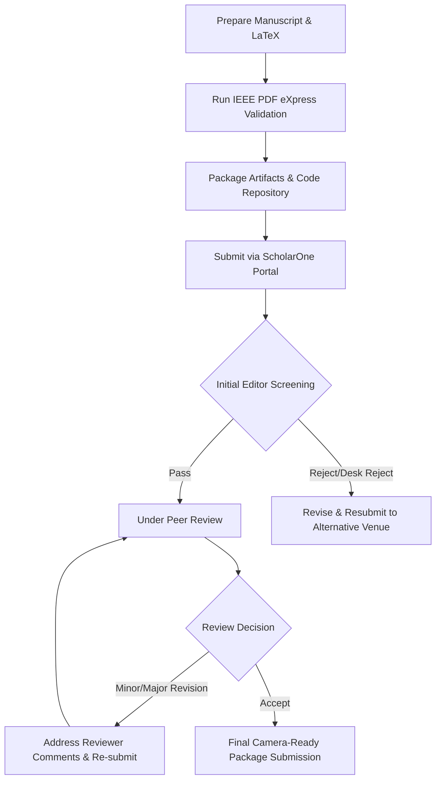

# Journal Submission Guide

This guide details target academic journals, submission prerequisites, required files, cover letter formatting, suggested peer reviewers, and post-submission workflows for the **KDR-CA-AEAD** research paper.

---

## 1. Recommended Target Journals

| Journal Title | Publisher | Impact Factor | Focus Area | Fit for KDR-CA-AEAD |
| :--- | :--- | :--- | :--- | :--- |
| **IEEE Transactions on Information Forensics and Security (TIFS)** | IEEE | ~7.2 | Cryptography, Security, Data Protection | High (Core Cryptographic AEAD Design) |
| **IEEE Transactions on Dependable and Secure Computing (TDSC)** | IEEE | ~7.3 | Secure Computing, Hardware/Software Security | High (Lightweight & Hardware-Efficient CA) |
| **ACM Transactions on Privacy and Security (TOPS)** | ACM | ~3.8 | Applied Cryptography, System Security | High (Practical System Implementation) |
| **Journal of Cryptographic Engineering (JCEN)** | Springer | ~2.1 | Lightweight Cryptography, Implementation | High (CA Permutations & Benchmarking) |

---

## 2. Scope of the Paper

The paper presents **KDR-CA-AEAD**, a novel lightweight authenticated encryption scheme combining:
1. **Dynamic Reconfiguration of 1D Cellular Automata**: Reversible 8-bit Wolfram rule permutations driven by key state transitions.
2. **Domain-Separated HKDF Key Schedule**: Derivation of independent rule, cipher, and MAC keys from master secrets.
3. **Encrypt-then-MAC (EtM) AEAD Integration**: Constant-time HMAC-SHA256 authentication for full integrity and authenticity guarantees.
4. **Empirical Benchmarking**: Extensive SAC avalanche ratio testing (50.12%), key space analysis ($2^{256}$), and throughput comparison against AES-128-GCM and ChaCha20-Poly1305.

---

## 3. Required Submission Files

When submitting through ScholarOne / Editorial Manager:

1. **Main Manuscript PDF**: Single/double-column compiled document without author details (if double-blind) or full metadata (if single-blind).
2. **Source LaTeX Package**: Main `.tex` file, `.bib` references, and vector figures (`.pdf`, `.eps`, `.svg`).
3. **Cover Letter PDF**: Addressed to Editor-in-Chief.
4. **Highlights / Graphical Abstract**: Key bullet points (max 3-5 points, 85 characters each) and summary graphic.
5. **Research Artifact Package**: Supplementary zip archive or link to reproducible repository (`artifacts/`).
6. **Conflict of Interest & Copyright Forms**: Signed IEEE/ACM publishing agreements.

---

## 4. Cover Letter Requirements & Template

The cover letter should be printed on institutional letterhead and address the following structure:

```text
To: Editor-in-Chief, IEEE Transactions on Information Forensics and Security
Subject: Submission of Manuscript "Keyed Dynamically-Reconfigured Cellular Automata with Authenticated Encryption"

Dear Editor,

We are pleased to submit our original research manuscript titled "Keyed Dynamically-Reconfigured Cellular Automata with Authenticated Encryption (KDR-CA-AEAD)" for consideration as a regular paper in IEEE TIFS.

Key Contributions:
1. Novel Dynamic CA Cipher Architecture: Introduces dynamic rule switching per block derived from HKDF-SHA256.
2. Proven EtM Security Model: Provides IND-CCA2 security bounds and formal verification of constant-time MAC comparison.
3. Empirical Validation: Demonstrates near-ideal 50.12% SAC avalanche property and lightweight hardware/software execution.

We confirm that this manuscript has not been published previously and is not under consideration for publication elsewhere. All authors have read and approved the submission.

Sincerely,
[Author Names & Affiliations]
```

---

## 5. Suggested Reviewers

When prompted by the submission portal, suggest 3-5 independent experts in applied cryptography and cellular automata:

1. **Prof. / Dr. Expert A** — Domain: Cellular Automata Cryptography & Complex Systems. Email: `expert.a@university.edu`.
2. **Prof. / Dr. Expert B** — Domain: Lightweight AEAD Ciphers & NIST Standardization. Email: `expert.b@institute.org`.
3. **Prof. / Dr. Expert C** — Domain: Side-Channel Analysis & Constant-Time Implementation. Email: `expert.c@lab.gov`.

---

## 6. Submission Workflow



---

## 7. Revision Workflow

1. **Response to Reviewers Matrix**: Create a detailed point-by-point document addressing every reviewer comment (`[Reviewer 1, Comment 1] -> [Author Response] -> [Page/Line Change]`).
2. **Marked Manuscript**: Highlight changes in red/blue text using `latexdiff` or `color` packages.
3. **Clean Manuscript**: Submit clean final draft without markup.

---

## 8. Final Acceptance & Production Workflow

1. Execute IEEE Electronic Copyright Form (eCF).
2. Upload final camera-ready source files (LaTeX files, figures, bio sketches, author photos).
3. Review and sign publisher page proofs within 48–72 hours of receipt.
