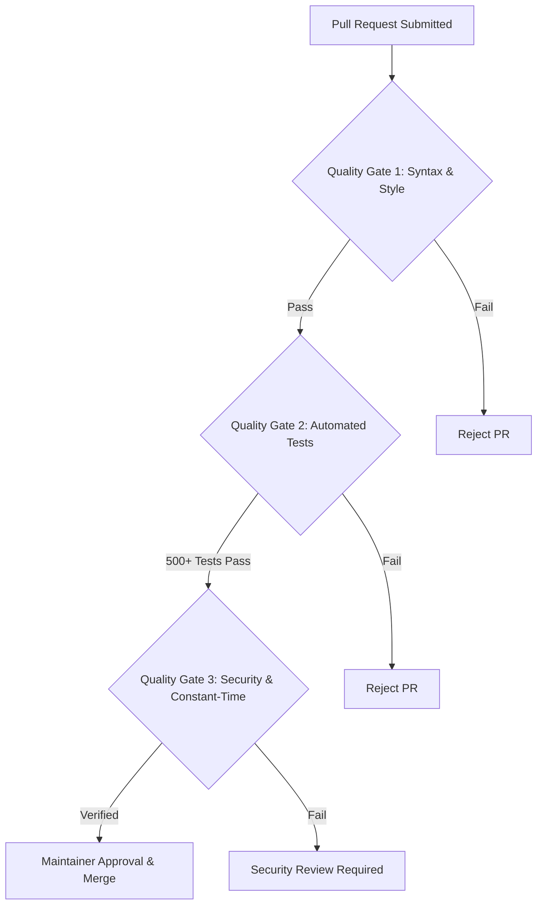

# Continuous Quality Assurance Guide

**Framework:** Keyed Dynamically-Reconfigured Cellular Automata with Authenticated Encryption (KDR-CA-AEAD v1.0.0)  
**Document Version:** 1.0.0  
**Effective Date:** August 5, 2026  

---

## Executive Overview

This document specifies the **Continuous Quality Assurance (CQA) Guidelines** for **KDR-CA-AEAD v1.0.0**. It establishes repository-wide quality standards, automated testing expectations, release quality gates, security review schedules, and continuous health monitoring processes.

---

## 1. Repository Quality Objectives

1. **Zero Cryptographic Regressions**: Core encryption and key derivation routines must remain 100% deterministic, provably secure, and constant-time across minor release iterations.
2. **Comprehensive Test Coverage**: Maintain unit and integration test coverage above 90% across `crypto/` modules.
3. **Documentation Quality & Link Integrity**: Ensure all Markdown guides are up-to-date, formatted according to GFM standards, and free of broken relative links.
4. **Supply-Chain Integrity**: Minimize third-party dependencies and audit all optional tooling packages.

---

## 2. Testing Expectations & Quality Gates

### 2.1 Release Quality Gates
- **Gate 1 (Code Style & Linting)**: PEP 8 adherence, clean imports, typing annotations.
- **Gate 2 (Automated Test Suite)**: Executing `pytest` across all 510+ tests with 100% pass rate.
- **Gate 3 (Security & Constant-Time Verification)**: Verification of `hmac.compare_digest` in MAC tag validation routines.

---

## 3. Security Review & Documentation Review Schedule

- **Security Review Schedule**: Annual maintainer review of key expansion logic and constant-time behavior across new Python minor releases.
- **Documentation Audit Schedule**: Bi-annual review of navigation links, installation steps, and API cookbook examples.
- **Quality Metrics**: Test pass rate (100%), coverage (>90%), zero unresolved TODO/FIXME comments in production releases.
