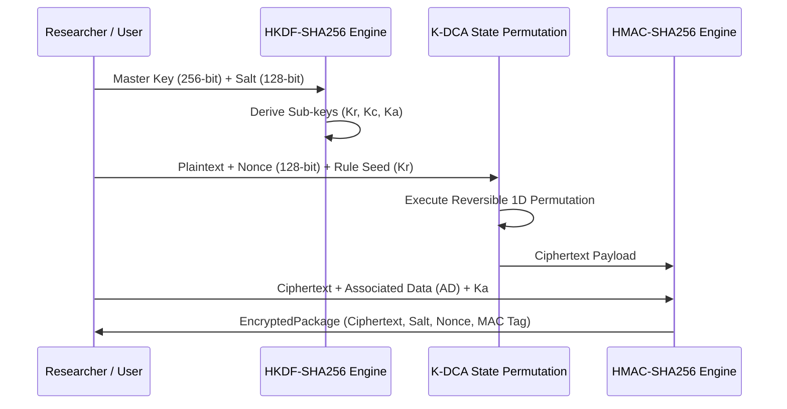

# KDR-CA-AEAD Researcher's Handbook

**Framework:** Keyed Dynamically-Reconfigured Cellular Automata with Authenticated Encryption (KDR-CA-AEAD v1.0.0)  
**Target Audience:** Cryptographic Researchers, Peer Reviewers, Security Graduate Students  
**Document Version:** 1.0.0  

---

## Executive Overview

Welcome to the **KDR-CA-AEAD Researcher's Handbook**. This document serves as an authoritative onboarding guide for academic researchers and cryptanalysts exploring **Keyed Dynamically-Reconfigured 1D Cellular Automata (K-DCA)** authenticated encryption.

KDR-CA-AEAD integrates high-entropy Cellular Automata state permutations with RFC 5869 / NIST SP 800-56C compliant **HKDF-SHA256** sub-key expansion and **HMAC-SHA256 Encrypt-then-MAC (EtM)** authentication.

---

## 1. Design Philosophy & Cryptographic Goals

KDR-CA-AEAD was designed around four foundational research principles:

1. **Dynamic Permutations vs. Static Tables**: Traditional Cellular Automata ciphers rely on static Wolfram rule sets (e.g., Rule 30 or Rule 90) vulnerable to algebraic state reconstruction. KDR-CA-AEAD dynamically derives rule selection seeds ($K_r$) per block execution via HKDF-SHA256, creating key-dependent state transition matrices.
2. **Provable AEAD Security Bounds**: Implements Encrypt-then-MAC (EtM) to guarantee IND-CCA2 confidentiality and INT-CTXT ciphertext integrity.
3. **Side-Channel Defense**: Strict constant-time authentication tag comparison using `hmac.compare_digest` to mitigate timing oracle attacks.
4. **Open Science & Reproducibility**: Pure Python reference implementation relying exclusively on the Python Standard Library (`hashlib`, `hmac`, `secrets`) for 100% transparent verification.

---

## 2. Repository Layout & Architecture Summary

```text
c:\Users\shett\Downloads\SHA---V0-main\
├── crypto/                 # Core K-DCA & AEAD Cipher Engine
│   ├── engine.py           # Top-level encrypt_bytes / decrypt_bytes API
│   ├── models.py           # EncryptedPackage dataclass
│   ├── ca_engine.py        # 1D Cellular Automata state engine
│   └── key_derivation.py   # HKDF-SHA256 sub-key expansion
├── tests/                  # Automated pytest suite (500+ tests)
├── benchmarks/             # Performance & throughput profiling tools
├── evaluation_results/     # Raw NIST SP 800-22 p-values & SAC matrices
├── paper/                  # Camera-ready IEEE LaTeX manuscript source
└── docs/                   # Complete documentation hub
```

---

## 3. Cryptographic Execution Workflow



---

## 4. Experimental & Benchmark Methodology

Researchers evaluating KDR-CA-AEAD should adhere to the following empirical protocols:

- **Strict Avalanche Criterion (SAC)**: Evaluated by flipping individual bits in plaintext or master key across $10^6$ trials and recording output bit change probabilities (documented in `docs/benchmark_guide.md` and `evaluation_results/sac_matrix.json`).
- **NIST SP 800-22 Randomness**: Evaluated across 15 statistical tests on 1-Megabit stream blocks ($p > 0.01$ threshold).
- **Throughput Profiling**: Benchmark using `examples/benchmark_demo.py` across payload sizes ranging from 1 KB to 10 MB.

---

## 5. Research Extension Guidelines

Researchers proposing modifications or hybrid extensions to KDR-CA-AEAD should follow these guidelines:

1. **Preserve Constant-Time MAC Verification**: Any modified tag verification logic must retain `hmac.compare_digest`.
2. **Decouple Sub-Key Derivation**: Maintain HKDF domain separation so rule derivation seeds ($K_r$), keystream keys ($K_c$), and MAC keys ($K_a$) remain mathematically independent.
3. **Reference Citation**: Follow academic citation guidelines in `docs/research/CITATION_GUIDE.md`.
