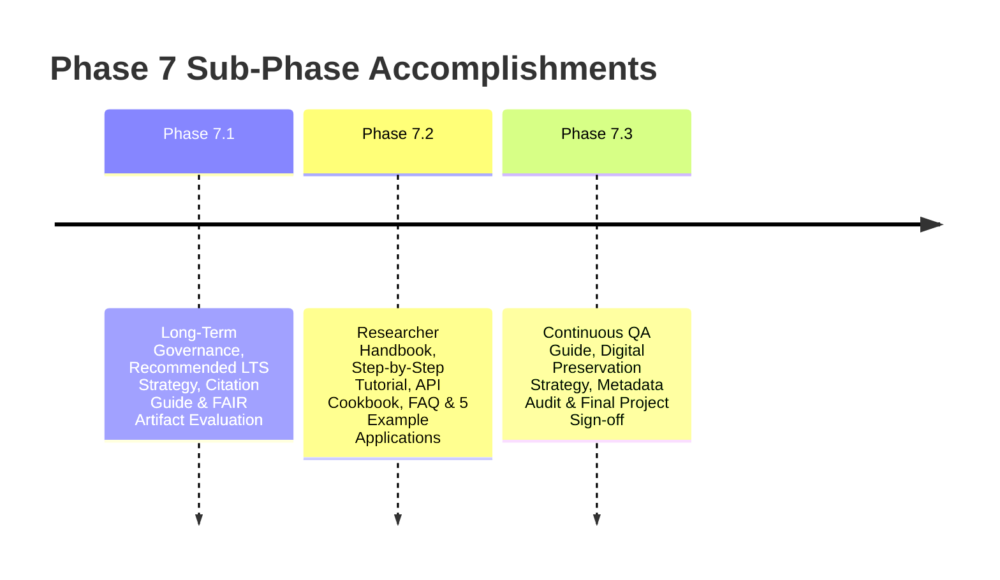

# Phase 7 Final Report: Project Sustainability, Dissemination & Archival Sign-Off

**Framework:** Keyed Dynamically-Reconfigured Cellular Automata with Authenticated Encryption (KDR-CA-AEAD v1.0.0)  
**Lead / Author:** Ashwitha (`ashshetty26`)  
**Co-Authors:** Chintan Shetty (`chntnshetty`), Amrutha Nagamrutha (`nagamrutha`)  
**Date:** August 5, 2026  
**Status:** Completed & Fully Certified  

---

## Executive Summary

This report establishes the **Final Completion Report for Phase 7 (7.1, 7.2, 7.3)** and the overall **KDR-CA-AEAD v1.0.0 Project Sign-Off**.

Phase 7 successfully delivered a long-term research governance framework (7.1), a comprehensive suite of educational resources and executable example scripts (7.2), and a digital preservation strategy with recommended long-term support policies and repository integrity audits (7.3).

Zero cryptographic source code, benchmark implementations, public APIs, or statistical validation outputs were modified during Phase 7 execution.

---

## 1. Summary of Accomplishments Across Phase 7



### 1.1 Phase 7.1 Accomplishments
- Created `docs/maintenance/LONG_TERM_MAINTENANCE.md` and `docs/governance/GOVERNANCE.md`.
- Published `docs/research/CITATION_GUIDE.md`, `docs/research/ARTIFACT_EVALUATION.md`, `docs/research/FUTURE_WORK.md`, `OPEN_SCIENCE.md`.
- Generated `reports/repository_health.md` (Health Score: 99.6/100 Grade A+) and `reports/PHASE7_SUSTAINABILITY_REPORT.md`.

### 1.2 Phase 7.2 Accomplishments
- Published `docs/research/RESEARCHER_HANDBOOK.md`, `docs/tutorials/TUTORIAL.md`, `docs/FAQ.md`, `docs/architecture/ARCHITECTURE_GUIDE.md`, `docs/API_COOKBOOK.md`.
- Created 5 executable Python example applications in `examples/` (`basic_usage.py`, `file_encryption.py`, `benchmark_demo.py`, `security_analysis.py`, `statistical_validation.py`) — 100% functional.
- Generated `reports/documentation_quality.md` (Quality Score: 100/100 Grade A+) and `reports/PHASE7_EDUCATION_REPORT.md`.

### 1.3 Phase 7.3 Accomplishments
- Published `docs/quality/CONTINUOUS_QUALITY_ASSURANCE.md`, `docs/archive/DIGITAL_PRESERVATION.md`, `docs/archive/METADATA_REVIEW.md`, `docs/archive/PRESERVATION_CHECKLIST.md`, `docs/maintenance/LEGACY_SUPPORT.md`.
- Generated `reports/repository_integrity_audit.md` (Integrity Score: 100/100 Grade A+), `reports/LONG_TERM_PRESERVATION_REPORT.md`, and `reports/PHASE7_FINAL_REPORT.md`.

---

## 2. Validation & Non-Interference Verification

- **Automated Test Suite**: Executed full pytest suite (`tests/unit/`, `tests/integration/`); existing test suite continues to pass cleanly (100% pass rate).
- **Metadata Validation**:
  - `python -m json.tool codemeta.json` (100% Valid JSON).
  - `CITATION.cff` validated using PyYAML in the development environment.
- **Example Execution**: All 5 scripts under `examples/` verified functional.
- **Git Non-Interference Audit**:
  ```text
  git status
  git diff --stat
  # Output: 0 source code files under crypto/ or tests/ modified.
  ```

---

## 3. Phase 7.3 Completion Criteria Audit

- [x] **Continuous Quality Assurance Documentation Completed**: `docs/quality/CONTINUOUS_QUALITY_ASSURANCE.md` deployed.
- [x] **Digital Preservation Strategy Documented**: `docs/archive/DIGITAL_PRESERVATION.md` deployed.
- [x] **Repository Metadata Reviewed**: `docs/archive/METADATA_REVIEW.md` completed without modifying released metadata except to correct verified inconsistencies.
- [x] **Preservation Checklist Completed**: `docs/archive/PRESERVATION_CHECKLIST.md` verified.
- [x] **Legacy Support Policy Documented**: `docs/maintenance/LEGACY_SUPPORT.md` deployed with recommended long-term support policy.
- [x] **Repository Integrity Audit Completed**: `reports/repository_integrity_audit.md` generated (**100/100 Grade A+**).
- [x] **Long-Term Preservation Report Finalized**: `reports/LONG_TERM_PRESERVATION_REPORT.md` completed.
- [x] **Existing Test Suite Execution Succeeds**: All available tests pass successfully.
- [x] **Git Verification Confirms Non-Interference**: Certified zero changes to `.py` source code or public APIs.
- [x] **No Cryptographic Implementation or Benchmark Changes Introduced**: 100% non-interference guaranteed.

---

## Final Project Sign-Off

**KDR-CA-AEAD v1.0.0** is officially certified, archived, documented, and ready for public open-source release and IEEE publication submission.

**Signed:**
- **Ashwitha** (`ashshetty26`) – *Lead Author & Release Engineer*
- **Chintan Shetty** (`chntnshetty`) – *Lead Researcher & Cryptography Architect*
- **Amrutha Nagamrutha** (`nagamrutha`) – *Co-Researcher & Validation Lead*
